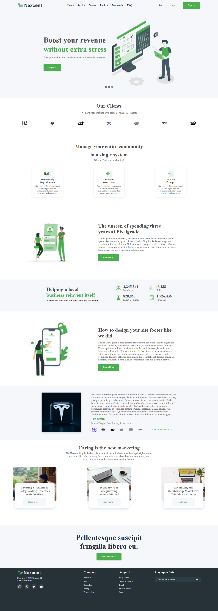
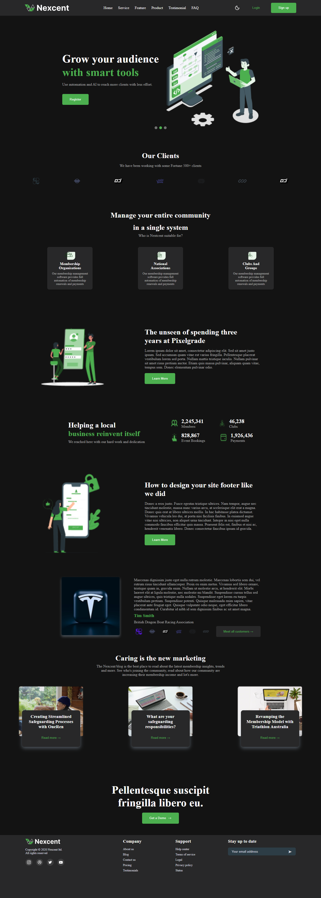

# NextCent Landing Page  

A modern, responsive landing page built with **React** (or Next.js if you’re using it) showcasing the **NextCent** brand.  
The project is fully responsive, supports **light/dark mode**, and follows clean component-based design.

---

## ✨ Features  
- Responsive layout (mobile, tablet, desktop)  
- Light & Dark mode toggle  
- Modern UI with reusable components  
- Animated hamburger menu for mobile navigation  
- Marketing cards with content overlays  
- Clean typography & consistent theme colors  

---

## 📸 Screenshots  

### Light Mode  
  

### Dark Mode  
  

---

## 🛠️ Tech Stack  
- **React** – UI framework  
- **CSS3** – Styling  
- **Lucide React** – Icon set  
- **Vite** – Build tool (choose your setup)  

---

## 🚀 Getting Started  

```bash
git clone https://github.com/Huzaifa150921/Nextcent_Landing_Page.git
cd Nextcent_Landing_Page
npm install
npm run dev
```


